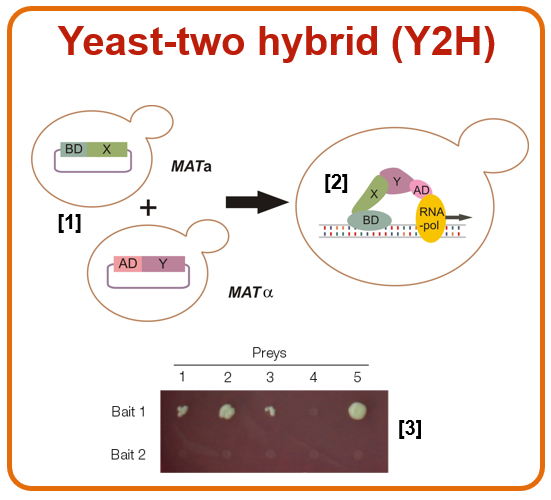
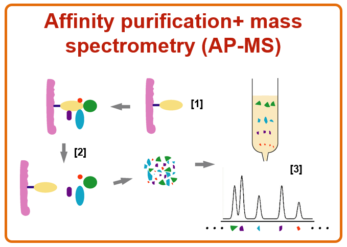

# Methods for gathering molecular interaction data

## 1. Yeast two-hybrid (high-throughput)
- Complementation assay
- Transcription factors consist of two parts
  1. DNA-binding domain (BD)
    - Binds to DNA
  2. DNA-activation domain (AD)
    - Activates RNA polymerase
- We want to know if two proteins of interest X and Y interact
- Call X the _bait_ and Y the _prey_
- Fuse BD to X and AD to Y
- If X and Y interact, then BD and AD will join and become activated, turning on a reporter gene for the researcher to readout

- The yeast two hybrid (Y2H) concept and a typical readout.
    1. The BD domain fused to the bait protein (X) and the AD domain fused to prey protein (Y) are expressed in yeast cells. 
    2. If proteins X and Y interact, BD binds DNA and AD activates RNA polymerase.
    3. An example readout of a Y2H assay with two bait proteins (Bait 1 and Bait 2) and five prey proteins (1 to 5).

### Advantages

### Disadvantages
- Interactions occur between proteins that would not normally be present in the
  same cellular compartment, in the same cell type, or at the same time
- (?) False positives occur when a yeast protein acts as a bridge for the
  interaction
- (?) Limitations inherent to heterologous expression: Both bait and prey proteins
  can fail to be expressed or might be toxic to the cell, big proteins might need
  to be cut down into manageable fragments, etc
- Needs a clone library!

## 2. Affinity purification mass spectrometry (AP-MS) (high-throughput)

- Affinity purification and mass spectometry (AP-MS).
    1. The bait protein (yellow) is immobilised on a matrix.
    2. A protein mixture is passed through and only the interacting partners (prey) are retained.
    3. In the following step the prey proteins are removed, digested with a protease and the resulting peptides are analysed by MS.

### Advantages

### Disadvantages
- Unable to detect binary relationships, only complexes of proteins interacting
  with the bait protein
- Prey proteins without a peptide signature recognisable by MS (owing to
  obscure post-translational modifications) or present in very low amounts will
  not be identified
- Relevant transient and/or weak interactions may be missed
- Mixing of compartments during cell lysis/purification is a potential source of
  false positives. For example, interactions between proteins that would not
  normally be in the same cellular compartment may confound results

## 3. Co-immunoprecipitation (Co-IP)
- Co-IP allows one to determine unknown proteins in a protein complex when one of the proteins in the complex is known.
- It works by selecting an antibody that targets the **known protein**. By targeting this known member of a complex with an antibody, one may be able to pull the **entire protein complex out of solution** and thereby identify unknown members of the complex

## 4. LUMIER

## 5. MAPPIT

## 6. FRET/BRET

## Sources
1. https://www.ebi.ac.uk/training-beta/online/courses/protein-interactions-and-their-importance/where-do-the-data-come-from/
2. http://europepmc.org/article/MED/20884196
